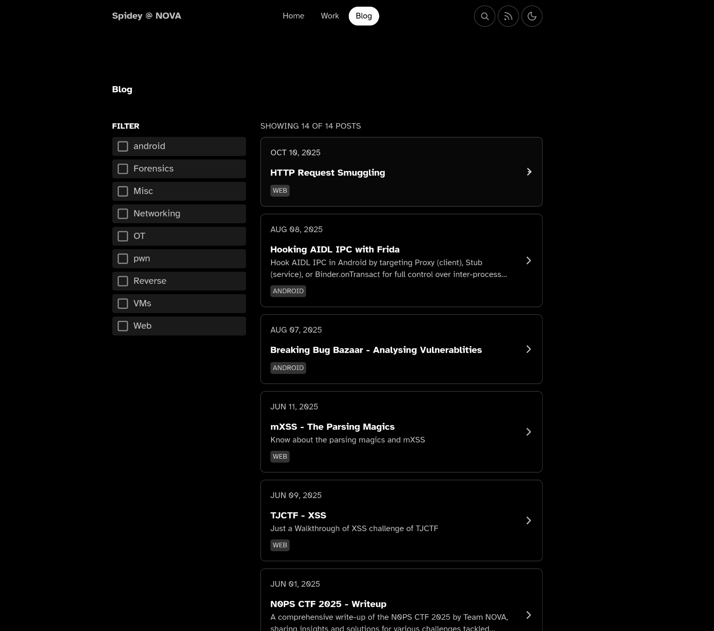
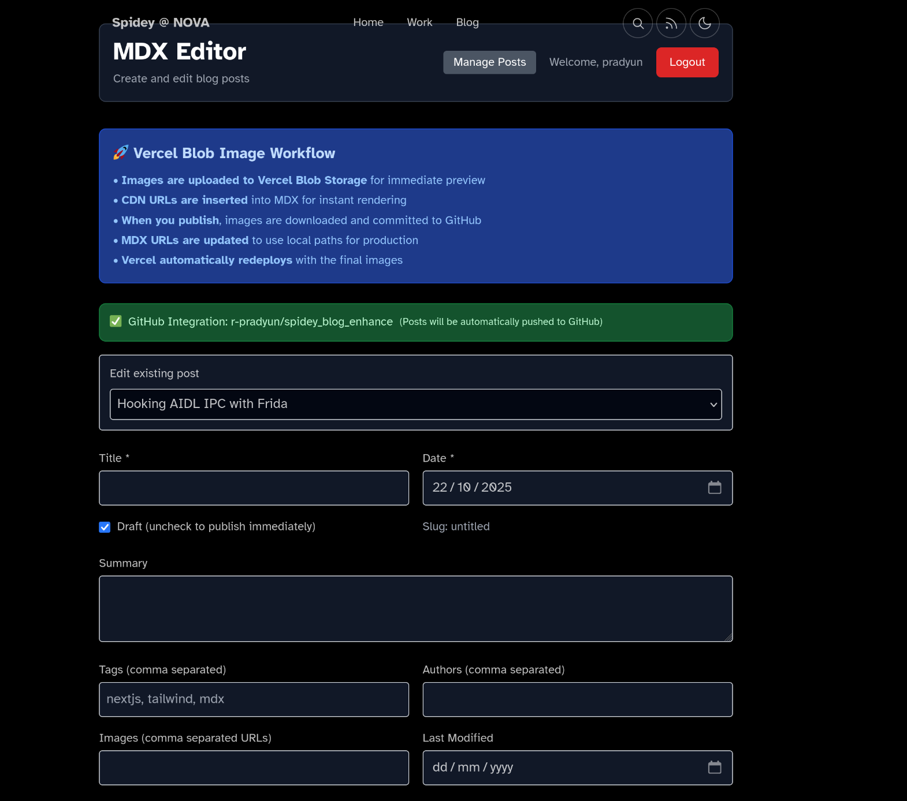
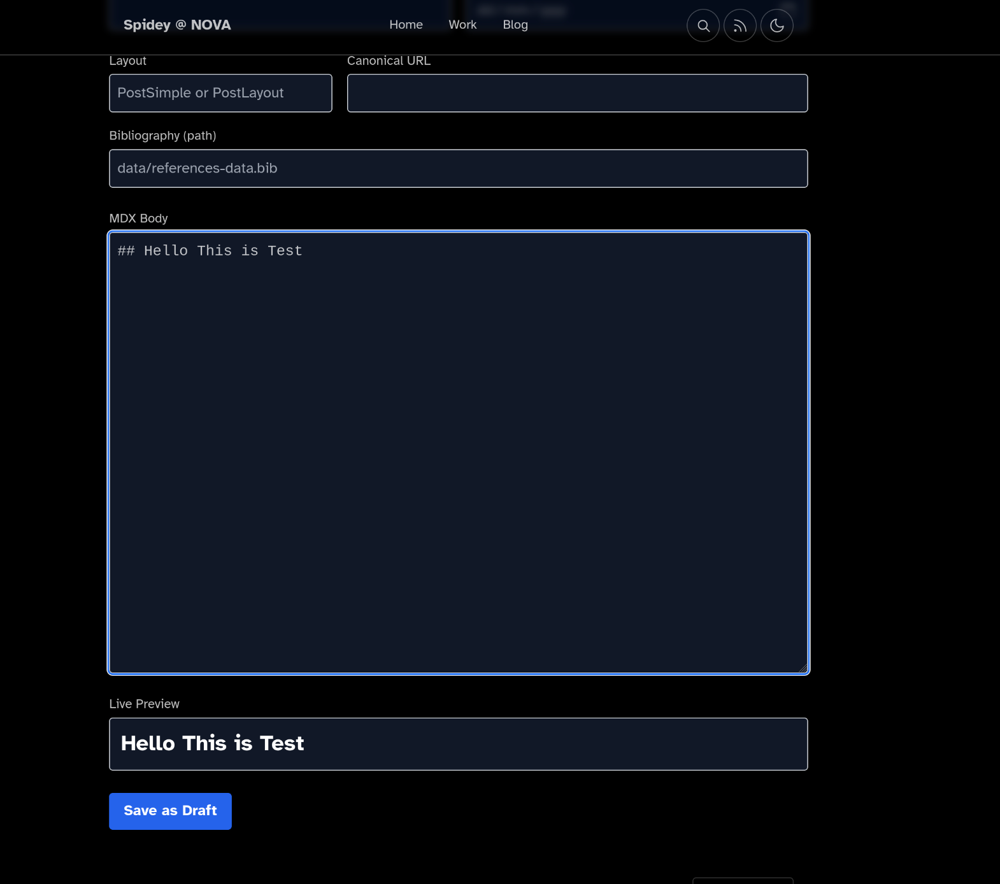
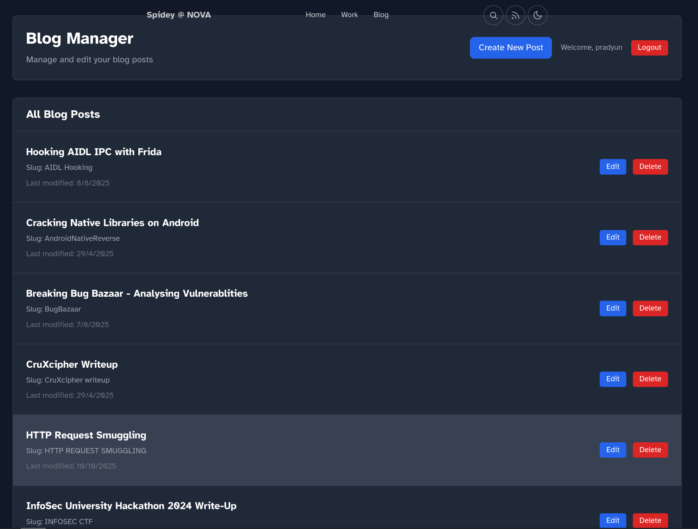
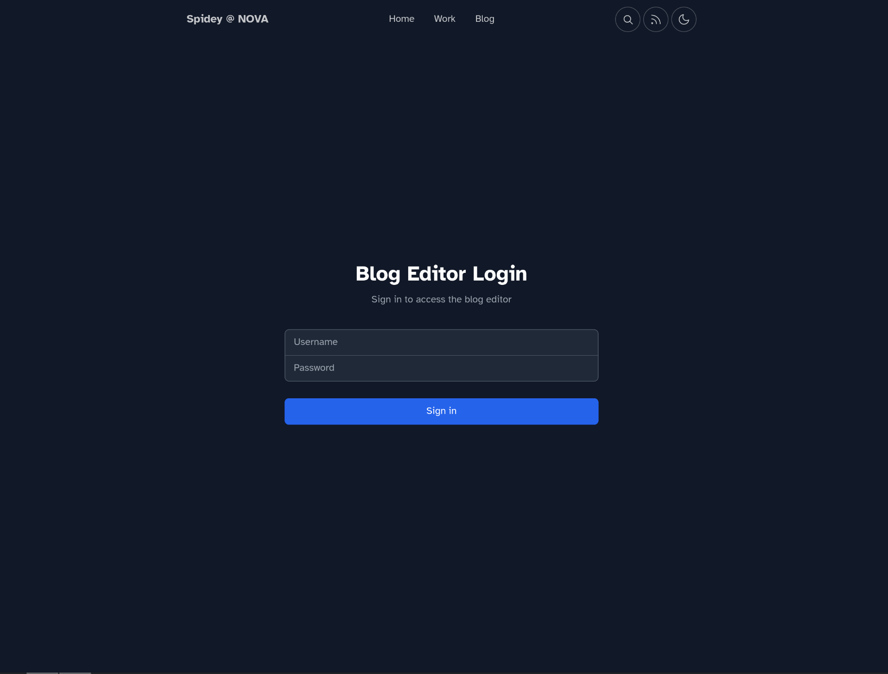

# 🕷️ Spidey Blog - Enhanced Astro Blog with GitHub Integration

A modern, feature-rich blog built with Astro that includes a built-in MDX editor, GitHub integration, and advanced content management capabilities. Perfect for developers who want a powerful blog with seamless deployment to Vercel.

## 🌟 Features

### 📝 **Built-in MDX Editor**
- **Live Preview**: Real-time MDX rendering as you type
- **Drag & Drop Images**: Upload images by dragging and dropping or pasting
- **Frontmatter Management**: Complete frontmatter editor with validation
- **Auto-save**: Automatic saving with unsaved changes warning
- **Load Existing Posts**: Edit any existing blog post seamlessly

### 🔐 **Authentication System**
- **JWT-based Authentication**: Secure session management
- **Admin Dashboard**: Protected admin area for content management
- **Session Management**: Automatic session handling with cookies
- **Role-based Access**: Admin and editor roles support

### 🔗 **GitHub Integration**
- **Automatic Commits**: All changes automatically committed to GitHub
- **Real-time Sync**: Live synchronization with your GitHub repository
- **Version Control**: Complete version history for all changes
- **Production Ready**: Works seamlessly when deployed to Vercel

### 🖼️ **Advanced Image Workflow**
- **Vercel Blob Storage**: Instant image uploads with CDN delivery
- **Automatic Processing**: Images processed and committed to GitHub on publish
- **Local Path Conversion**: Automatic URL conversion for production
- **Image Management**: Complete image lifecycle management

### 📊 **Content Management**
- **Blog Manager**: Centralized dashboard to manage all posts
- **CRUD Operations**: Create, Read, Update, Delete blog posts
- **Bulk Operations**: Manage multiple posts efficiently
- **Search & Filter**: Find posts quickly with built-in search

### 🎨 **Modern UI/UX**
- **Responsive Design**: Works perfectly on all devices
- **Dark Mode**: Built-in dark/light theme support
- **Smooth Animations**: Polished user experience
- **Accessibility**: WCAG compliant design

## 🚀 Quick Start

### Prerequisites
- Node.js 20.x or higher
- GitHub account with repository access
- Vercel account (for deployment)

### Installation

1. **Clone the repository**
   ```bash
   git clone https://github.com/r-pradyun/spidey_blog_enhance.git
   cd spidey_blog_enhance
   ```

2. **Install dependencies**
   ```bash
   npm install
   ```

3. **Set up environment variables**
   Create a `.env` file in the project root:
   ```bash
   # GitHub Integration (Required for production)
   GITHUB_TOKEN=your-github-personal-access-token
   GITHUB_OWNER=your-github-username
   GITHUB_REPO=your-repository-name

   # Admin Authentication
   EDITOR_USERNAME=admin
   EDITOR_PASSWORD=admin123
   JWT_SECRET=your-super-secret-key-here-change-this

   # Vercel Blob Storage (for image uploads)
   BLOB_READ_WRITE_TOKEN=your-vercel-blob-token

   # Optional
   REVALIDATION_SECRET=your-super-secret-key-here-change-this
   GITHUB_WEBHOOK_SECRET=your-github-webhook-secret-here
   ```

4. **Start development server**
   ```bash
   npm run dev
   ```

5. **Access the application**
   - Main blog: `http://localhost:4321`
   - Editor: `http://localhost:4321/editor`
   - Admin: `http://localhost:4321/blog-manager`

## 📸 Screenshots

### 🏠 **Homepage**
<!-- Add screenshot of homepage here -->

*Clean, modern homepage with blog post listings*

### ✏️ **MDX Editor**
<!-- Add screenshot of editor here -->


*Powerful MDX editor with live preview and image upload*

### 📊 **Blog Manager**
<!-- Add screenshot of blog manager here -->

*Centralized dashboard for managing all blog posts*

### 🔐 **Login Page**
<!-- Add screenshot of login page here -->

*Secure authentication system*

## 🛠️ Technical Stack

- **Framework**: [Astro](https://astro.build/) - Modern static site generator
- **Styling**: [Tailwind CSS](https://tailwindcss.com/) - Utility-first CSS framework
- **Content**: [MDX](https://mdxjs.com/) - Markdown with JSX components
- **Authentication**: Custom JWT implementation
- **Storage**: [Vercel Blob](https://vercel.com/storage/blob) - Image storage
- **Deployment**: [Vercel](https://vercel.com/) - Serverless deployment
- **Version Control**: GitHub integration

## 📁 Project Structure

```
spidey_blog_enhance/
├── src/
│   ├── components/          # Reusable UI components
│   ├── content/            # Blog content and configuration
│   │   ├── blog/           # Blog posts (slug/index.md)
│   │   ├── projects/       # Project showcases
│   │   └── work/           # Work experience
│   ├── layouts/            # Page layouts
│   ├── lib/                # Utility libraries
│   │   ├── auth.ts         # Authentication system
│   │   ├── github.ts       # GitHub API integration
│   │   └── utils.ts        # Helper functions
│   ├── pages/              # Pages and API routes
│   │   ├── api/            # API endpoints
│   │   │   ├── auth/       # Authentication APIs
│   │   │   └── editor/     # Editor APIs
│   │   ├── editor.astro    # MDX editor page
│   │   ├── blog-manager.astro # Blog management
│   │   └── login.astro     # Login page
│   └── styles/             # Global styles
├── public/                 # Static assets
└── vercel.json            # Vercel configuration
```

## 🔧 Configuration

### GitHub Setup

1. **Create Personal Access Token**
   - Go to GitHub → Settings → Developer settings → Personal access tokens
   - Generate new token with `repo` scope
   - Copy the token

2. **Configure Environment Variables**
   ```bash
   GITHUB_TOKEN=ghp_your_token_here
   GITHUB_OWNER=your-username
   GITHUB_REPO=your-repo-name
   ```

### Vercel Blob Setup

1. **Create Vercel Blob Store**
   - Go to Vercel Dashboard → Storage → Blob
   - Create a new blob store
   - Copy the read/write token

2. **Add Environment Variable**
   ```bash
   BLOB_READ_WRITE_TOKEN=vercel_blob_token_here
   ```

## 🚀 Deployment

### Vercel Deployment

1. **Connect Repository**
   - Connect your GitHub repository to Vercel
   - Import the project

2. **Set Environment Variables**
   - Add all required environment variables in Vercel dashboard
   - Ensure GitHub integration is configured

3. **Deploy**
   - Vercel will automatically deploy on every push
   - The editor will work seamlessly with GitHub integration

### Other Platforms

For other deployment platforms, ensure:
- GitHub integration is configured
- Vercel Blob storage is accessible
- Environment variables are set
- Node.js 20.x is supported

## 📖 Usage Guide

### Creating Blog Posts

1. **Access Editor**
   - Navigate to `/editor`
   - Login with admin credentials

2. **Fill Frontmatter**
   - Title, date, summary
   - Tags and authors
   - Images and metadata

3. **Write Content**
   - Use MDX syntax
   - Drag and drop images
   - Live preview updates

4. **Save/Publish**
   - Save as draft or publish immediately
   - Images automatically processed
   - Changes committed to GitHub

### Managing Posts

1. **Access Blog Manager**
   - Navigate to `/blog-manager`
   - View all blog posts

2. **Edit Posts**
   - Click edit button
   - Loads post in editor
   - Make changes and save

3. **Delete Posts**
   - Click delete button
   - Confirms deletion
   - Removes entire post folder from GitHub

### Image Management

1. **Upload Images**
   - Drag and drop in editor
   - Paste from clipboard
   - Images uploaded to Vercel Blob

2. **Automatic Processing**
   - Images processed on publish
   - Committed to GitHub repository
   - URLs updated for production

## 🔒 Security Features

- **JWT Authentication**: Secure session management
- **Environment Variables**: Sensitive data protection
- **GitHub Token Security**: Scoped access tokens
- **Input Validation**: All inputs validated
- **Error Handling**: Secure error responses

## 🎯 API Endpoints

### Authentication
- `POST /api/auth/login` - User login
- `POST /api/auth/logout` - User logout
- `GET /api/auth/verify` - Verify session

### Editor
- `GET /api/editor/list` - List all blog posts
- `GET /api/editor/get?slug=<slug>` - Get specific post
- `POST /api/editor/save` - Save/create post
- `POST /api/editor/upload` - Upload image
- `DELETE /api/editor/delete?slug=<slug>` - Delete post
- `GET /api/editor/github-status` - Check GitHub integration

## 🤝 Contributing

1. Fork the repository
2. Create a feature branch
3. Make your changes
4. Test thoroughly
5. Submit a pull request

## 📄 License

This project is licensed under the MIT License - see the [LICENSE](LICENSE) file for details.

## 🙏 Acknowledgments

- [Astro](https://astro.build/) for the amazing framework
- [Tailwind CSS](https://tailwindcss.com/) for styling
- [Vercel](https://vercel.com/) for deployment and storage
- [GitHub](https://github.com/) for version control integration

## 📞 Support

If you have any questions or need help:

- Create an issue on GitHub
- Check the documentation
- Review the code comments

---

**Built with ❤️ by [Pradyun](https://github.com/r-pradyun)**

*This blog showcases modern web development practices with Astro, GitHub integration, and serverless deployment.*
