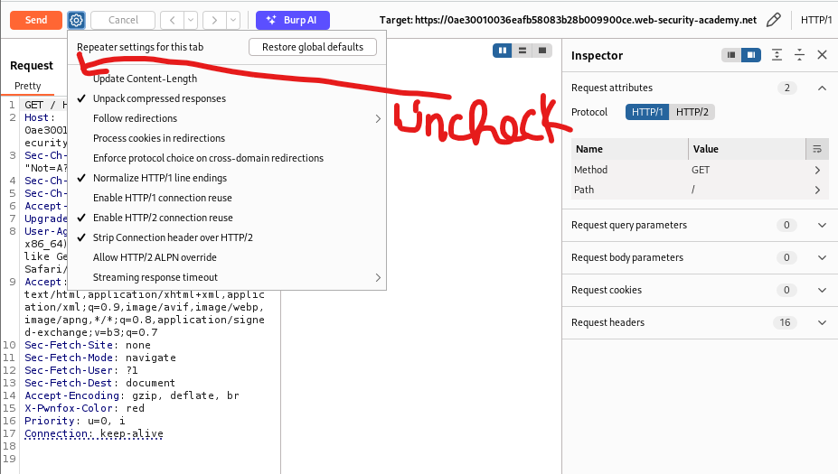
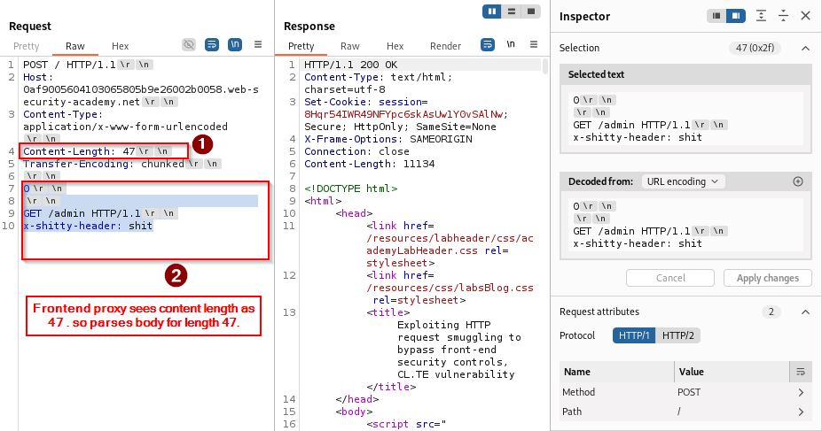
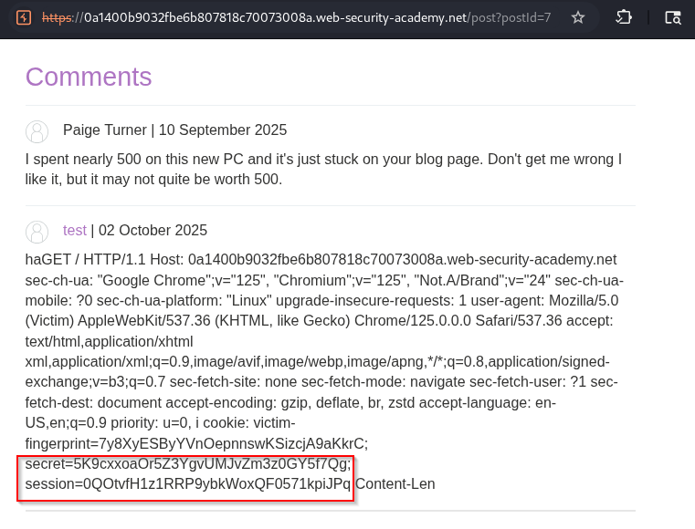
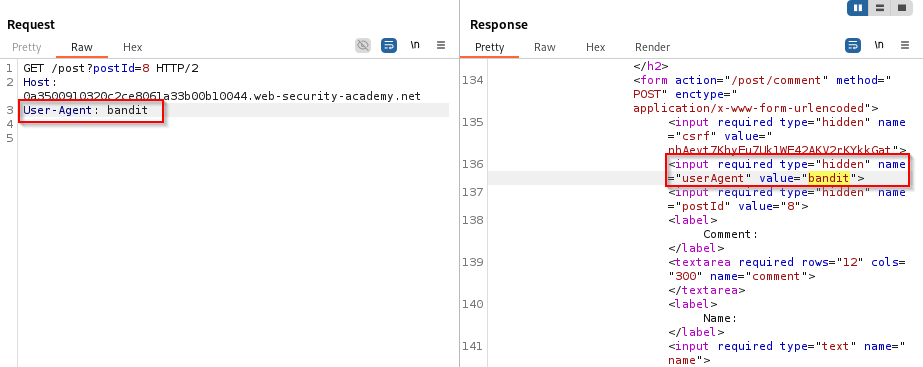

## Introduction

Ever wonder how a seemingly normal HTTP request can hide a malicious one? HTTP request smuggling happens when a proxy or load balancer and the backend server disagree on where one request ends and the next begins. That tiny mismatch lets attackers sneak in hidden requests.

---
## What is HTTP REQUEST SMUGGLING ? 

HTTP request smuggling occurs when an attacker crafts a single HTTP message that is interpreted differently by an intermediary (proxy/load balancer) and the backend server. Because the two ends disagree on where one request ends and the next begins, an attacker can “smuggle” a hidden request to the backend , gaining unauthorized access, bypassing filters, exfiltrating data , or performing actions as other users.

---
## HTTP fundamentals

### How HTTP over TCP works (connection lifecycle)

- A TCP connection is opened and HTTP data is sent over it.
    
- In HTTP/1.0, typically each request used a separate TCP connection.
    
- To reuse the same TCP connection for multiple requests, HTTP/1.1 introduced persistent connections. The `Connection: keep-alive` header keeps the TCP connection open; `Connection: close` closes it.
    


When multiple requests are sent sequentially over the same TCP connection, the server must determine where a request ends before parsing the next one. If an intermediary and a backend disagree on request boundaries, request smuggling becomes possible.

---

## Why HTTP desync occurs

A typical setup: a frontend (load balancer/proxy) accepts client connections and forwards requests to an application backend. If the frontend and backend parse the request body differently, they will perceive different message boundaries , and that is the root cause of desynchronization.


### How the backend determines the end of a request

When requests are pipelined over the same connection, the server uses one of these to separate requests:

1. **GET / HEAD / simple requests** , data for this method consists of parameters, ending with HTTP/1.1 or HTTP/2; no body is expected
    
2. **Requests with bodies** (e.g., `POST`) , delimited by:
    
    - `Content-Length: <length_of_body>` header, **or**
        
    - `Transfer-Encoding: chunked` (TE).
        

Both sides must agree. If one side uses CL and the other TE, they can interpret the stream differently , which is exploitable.

#### Content-Length (CL)


#### Transfer-Encoding: chunked (TE)


> Note: HTTP/1.1 allows both `Content-Length` and `Transfer-Encoding` to be present, but `Transfer-Encoding` takes precedence in compliant implementations. However, proxies and backends vary in how they implement or enforce this , which creates opportunities for smuggling.

---

## Detecting vulnerable behavior

You can detect differences by sending crafted requests where CL and TE are both present and observing how the chain reacts.


Two canonical test patterns:

**TE then CL (TE CL)** , try to sneak bytes interpreted differently:

```
Content-Length: 6
Transfer-Encoding: chunked


3
abc
X

```

**CL then TE (CL TE)** , another variant:

```
Content-Length: 6
Transfer-Encoding: chunked

0
0

X
```

If the server or proxy responds unexpectedly (e.g., errors, responses for secondary requests, or visible side effects), that indicates differing parsers and potential vulnerability.

---

## Burp Suite , basic setup for testing

When testing manually in Burp, make sure to:

1. Downgrade/modify the request line headers where appropriate.  
    
    
2. Disable automatic Content-Length recalculation so your crafted lengths remain unchanged.  
    
    
3. Use raw request editing / Repeater to craft and send test payloads.  
    
    

---

## CL → TE attack (Content-Length interpreted first by frontend)

This pattern occurs when the frontend trusts `Content-Length` and the backend trusts `Transfer-Encoding`. By inserting a properly formatted chunked body that contains an embedded request, the backend will process the embedded request once it finishes processing the chunked stream.

Example artifacts/screenshots:

  

- **Frontend (CL):** The frontend reads the entire body as data (including an embedded request) because it uses `Content-Length`.
    
- **Backend (TE):** The backend parses the body as chunked transfer encoding and reads chunks until it encounters the `0` terminator.  The body contains a `0` chunk initially , the backend treats the chunked stream as finished and any remaining bytes are interpreted as the next request.

Sequence diagrams and Burp views:  
  
  


Interpretation: depending on where the boundary is, the backend processes the smuggled request while the frontend believes it has handled only the original request.

---

## TE → CL attack (Transfer-Encoding interpreted by frontend)

When the frontend uses chunked (TE) and the backend uses Content-Length, wrap a full request inside chunked data so the frontend forwards it but the backend reads the chunked body and treats the first chunk as an independent request because content length ends before the chunk request

High-level diagram:  


Explanation:

- The frontend uses TE , it takes the chuck till `0` (termination for TE) . to keep in mind TE also has the chunk length to be specified before the chunk data . 
    
-  the backend expects `Content-Length` to make the chunk data as another request, we make interpret a till chunk length header (e.g., `3\r\n`)  by specifing as `Content-Length : 3`


Frontend and backend views:  
  


Result: the smuggled request is processed as a separate request by the backend on subsequent reads. The attacker can confirm with a simple normal request that triggers the smuggled behavior:  


---

## Bypassing frontend (proxy) security

Attackers can exploit CL/TE mismatches to bypass proxy restrictions (e.g., internal-only endpoints like `/admin`) because the proxy inspects and blocks requests based on its interpretation, while the backend receives a different request.

### CL → TE bypass

- **Scenario**: proxy blocks `/admin` requests, backend contains `/admin` logic and lacks validation.
    
##### IDEA:
- **Frontend (CL):** The frontend reads exactly the number of bytes specified in the `Content-Length` header (for example, `Content-Length: 47`). Note: the content body contains a `0` that the backend may treat as a chunk terminator.
    
- **Backend (TE):** The backend interprets the data using chunked transfer encoding. Each chunk begins with a length line (for example, `3\r\n`) followed by the chunk data; the chunk stream is terminated with `0\r\n`. If the content body contains an initial `0` chunk, the backend will treat that as the end of the chunked stream, and any remaining bytes may be parsed as a separate request.
    

Constructed request example:

```
Content-Length: <length_of_the_body>
Transfer-Encoding: chunked
\r\n
0\r\n    <-- terminates the chunked body for backend
\r\n
GET /admin HTTP/1.1\r\n
x=
```

Visuals: proxy/front-end parsing vs backend parsing.  
  


Host header duplication and consequences:

Sometimes the backend receives duplicated headers (e.g., two `Host:` lines) because the input stream contains a `GET` request embedded inside the body. Example result the backend might see:

```
GET /admin HTTP/1.1
Host: localhost
x-shitty-header: shitPOST / HTTP/1.1
Host: 0ad4000f0313b25f8040944c004d00b5.web-security-academy.net
Content-Type: application/x-www-form-urlencoded
Content-Length: 0
```

What we will do is convert the input stream request into the request body, specifying the content length so that it consumes the entire request as the body.

In practice, placing the embedded request into the body and ensuring headers like `Host: localhost` allow the backend to treat it as local/internal will often grant access to internal pages:  
  


Resulting backend view after smuggling:

```
GET /admin HTTP/1.1
Host: localhost
Content-Type: application/x-www-form-urlencoded
Content-Length: 148

x=POST / HTTP/1.1
Host: 0ad4000f0313b25f8040944c004d00b5.web-security-academy.net
Content-Type: application/x-www-form-urlencoded
Content-Length: 0
```

### TE → CL bypass

- **Scenario**: proxy blocks `/admin` requests, backend contains `/admin` logic and lacks validation.

##### IDEA:
- **Frontend (TE):** Sends data in chunked format. Each chunk has its **length line** (e.g, `3\r\n`) and then the chunk data. Terminate with `0\r\n`.
    
- **Backend (CL):** Reads exactly the number of bytes specified in the `Content-Length` header. If you specify `Content-Length: 3`, the backend interprets the first chunk as the **entire request body**, allowing the next bytes (the rest of the TE chunks) to form a separate request (`GET /admin`).

Constructed request example:

```
Content-Length: 4 ---> length of "b7\r\n"
Transfer-Encoding: chunked
\r\n
b7\r\n  ------> backend interpretation ends here since length is 4
GET /admin HTTP/1.1\r\n
...
...
...
\r\n
0\r\n
\r\n
```


Front-end/body view:  uses TE , `b7` chunk size , the chunk ends by `0` (termination)


Backend view:  uses CL , since it is `4` . takes the chunk size only as body data , remaining as next request


Subsequent request confirms internal admin access:  


By setting `Host: localhost` and repeating the pattern, access to internal pages is demonstrable:  
  


A practical exploit could perform administrative actions (e.g., delete a user):  
  


---

## Frontend rewriting of headers (custom header insertion)

Some environments inject custom headers (e.g., `X-pePmgK-Ip`) that reflect the client IP or other metadata. If an attacker can cause the proxy to rewrite or reflect that header into an input the attacker controls, it can be used to escalate a smuggling attack.

- The lab observed a search parameter reflected in the response. This reflection can be abused to show rewritten headers returned by the frontend:  
    
    
- By crafting a smuggled request whose content length accommodates the rewritten header (set e.g., to `100`) and ensuring the custom header points to `localhost`, the backend treats the request as internal:  
      
    
    
- Once the frontend rewrites the header (e.g., `X-pePmgK-Ip: <client-ip>`), the smuggled request with `X-pePmgK-Ip: localhost` lets subsequent requests access the admin panel:  
      
    
    

Actions such as deleting a user can be performed by smuggling the admin request and confirming via a subsequent request:  


---

## Stealing other users’ data via request smuggling

One powerful impact is stealing or injecting other users’ requests into the attacker-controlled payload. The pattern:

1. Attacker sends a smuggled request that claims a very large `Content-Length` (so backend waits for many bytes).
    
2. While the backend is waiting to complete that request, another (honest) user’s request may get appended to the backend’s read buffer.
    
3. The backend then appends the honest user’s request bytes to the attacker's request body, exposing its contents , including cookies, CSRF tokens, session identifiers, etc.
    

Example injection into a form comment (the comment parameter is appended with another user request):

```
csrf=<token>&name=<name>&postId=<id>&email=<email>&website=<website>&comment=<otheruser_request_appended_here>
```

Attack visuals:  
  
  


An attacker can then replace their own browser session cookie with the stolen session (or simply read the admin cookie) and access the victim’s dashboard as `admin`:  
  


---

## Stored XSS via smuggled requests

Smuggling can also deliver reflected headers or request metadata that are echoed to other users , enabling XSS.

- If a backend reflects `User-Agent` or another header and you can smuggle an HTML/JS payload into that header, subsequent users will see the payload executed.
    

Evidence:  
  


A smuggled request embedding a reflected `User-Agent` XSS payload will cause subsequent visitors to execute the script:  
  


---

## Practical checklist for testing

1. **Confirm CL vs TE behavior**: Send requests containing both headers and observe which header each component respects.
    
2. **Disable automatic CL updates** in your proxy/interception tool (Burp) to preserve intentionally broken/misaligned headers.
    
3. **Use incremental tests**: small chunk sizes, then embed simple `GET /poc` payloads, then escalate to sensitive endpoints.
    
4. **Observe duplication**: duplicated `Host` and other headers are strong indicators of parsing differences.
    
5. **Monitor for side effects**: 404s for the normal request, unexpected backend responses, or access to internal endpoints.
    
6. **Log everything**: record the byte-level request stream and server responses whenever possible.
    

---

## Mitigations and defenses

To prevent request smuggling, deploy multiple layers of defense:

**Configuration / Protocol fixes**

- Ensure consistent parsing behavior across frontends and backends. Align HTTP version and request parsing libraries.
    
- Remove support for ambiguous cases: do not accept both `Transfer-Encoding: chunked` and `Content-Length` in the same request.
    
- Normalize inbound requests at the edge (reject ambiguous requests early).
    
- Configure proxies to validate and strictly parse chunked encoded bodies by the standard (RFC 7230).
    

**Application hardening**

- Don’t trust headers that can be influenced by the client or intermediary (e.g., `X-Forwarded-*`, custom IP headers) without verification.
    
- Validate internal-only endpoints by source IP and application-layer authentication , do not rely solely on `Host` or a proxy-inserted header for access control.
    
- Use robust CSRF/anti-forgery tokens and require authentication for privileged actions , so stolen requests alone are insufficient.
    

**Monitoring and detection**

- Log and alert on unusual header patterns (duplicate headers, inconsistent `Content-Length` values).
    
- Monitor for unexpected sequences of requests or unusual responses to pipelined requests.
    
- Regularly test staging and production configurations for CL/TE differences.
    

---
## Tools and References

-  [HTTP Request Smuggler](https://portswigger.net/bappstore/aaaa60ef945341e8a450217a54a11646) 
- [Smuggler](https://github.com/defparam/smuggler)
- [PortSwigger](https://portswigger.net/web-security/request-smuggling)
-  [HTTP Request Smuggling By Jarno Timmermans](https://www.youtube.com/playlist?list=PLGb2cDlBWRUX1_7RAIjRkZDYgAB3VbUSw) 

---
